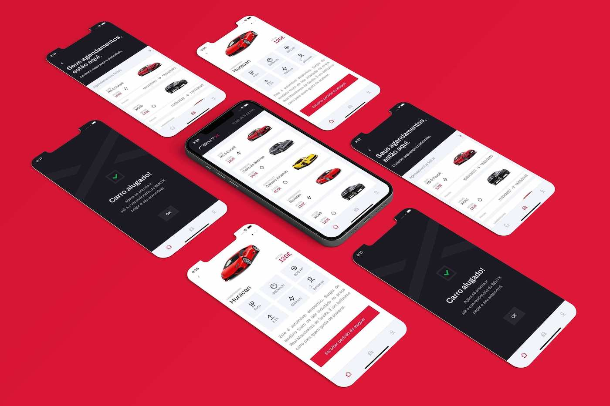

<h1 align="center">
  <!-- RentX -->
  
</h1>


<p align="center">
 <a href="#about-the-project">About the project</a> •
 <a href="#technologies">Technologies</a> •
 <a href="#development-setup">Development Setup</a> •
 <a href="#License">License</a> •
 <a href="#author">Author</a>
</p>


## About the project

RentX is a renting cars app, developed during the Rocketseat Ignite course. This project use Expo, TypeScript, Styled-Components, React Native Calendars, React Navigation, Axios, Yup, React Native Reanimated, Lottie for React Native and WatermelonDB to Offline First.

<div align="center">
    
</div>

---

## Technologies

Technologies used to build the application

- [ReactJS](https://reactjs.org/)
- [React Native](https://reactnative.dev/)
- [Expo](https://expo.dev/)
- [TypeScript](https://www.typescriptlang.org/)
- [Styled Components](https://styled-components.com/)
- [React Navigation](https://reactnavigation.org/)
- [Yup](https://github.com/jquense/yup/)
- [Axios](https://github.com/axios/axios/)
- [WatermelonDB](https://github.com/Nozbe/WatermelonDBs)
- [React Native Calendars](https://github.com/wix/react-native-calendars/)
- [React Native Calendars](https://github.com/wix/react-native-calendars/)
- [React Native Reanimated](https://github.com/software-mansion/react-native-reanimated)


---

## Development Setup

### **Requirements**

Dependencies:

- [Git](https://git-scm.com/)
- [Yarn](https://classic.yarnpkg.com)


### **Clone the project**

```bash
# Run the command git clone  to clone the repository
$ git clone https://github.com/hppc25/rn-rent-X
#  change to directory
$ cd rn-rent-X
```

### **Setup the project**

```bash
# install dependencies
$ yarn

# Run the project with Expo 
$ expo start 

# Run the project without Expo 
$ - yarn start # you can open iOS, Android, or web from here, or run them directly with the commands below.
$ yarn android
$ yarn ios
$ yarn web

```

---

## License

The MIT License. Checnk [LICENSE](LICENSE) for more information.

---

## Author

By Helder Correia 👋🏽 Get in touch!

[](https://www.linkedin.com/in/helder2pc/)
[](mailto:hppc25@gmail.com)
